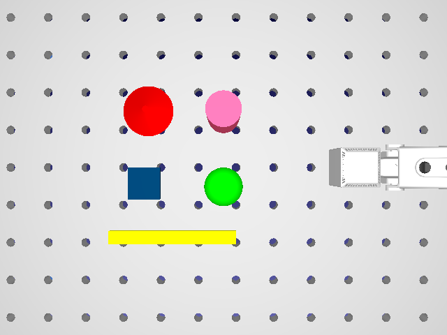
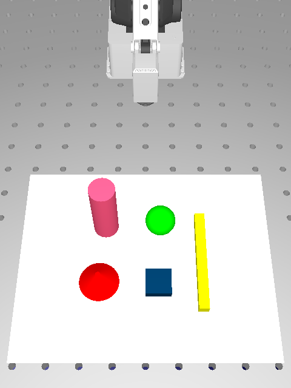
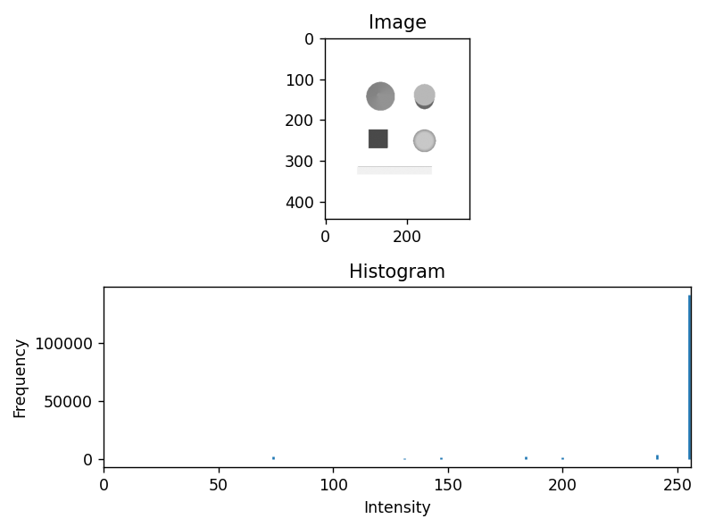
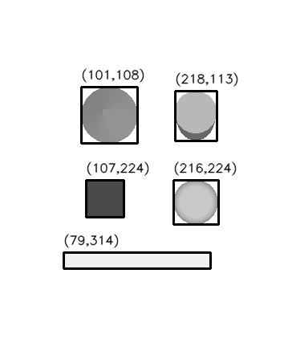

## Lab assignment: Segmentation

### Week 1( 02/02/2026)

### Lab Overview

A. Take a simulated image from RoboDK and perform segmentation.

- Apply thresholding
- Clean up binary images using morphological operations
- Extract basic object features (contours, area, centroid)
- Annotate and visualize detected object positions on the image

B. Capture a real image on the scenario (tiles on the table) and perform segmentation.

By the end of this lab, learn first end-to-end pipeline from a camera image to object locations – a building block for vision-based pick-and-place.

### Learning Goals

- Choose and apply appropriate thresholding methods for a given image.
- Use morphological operations to improve segmentation quality.
- Find connected components/contours in a binary image.
- Annotate detected objects on the image.

### Part A - Simulated Image

1. Task A1 - Create Simulated Scenario

In RoboDK, table holes may be detected as objects, so place a white sheet of paper on the table. Use the same scenario from the first assignment with this addition.

2. Task A2 - Capture image from RoboDK Simulated Camera

Histogram Visualization

3. Task A3 - Thresholding

- We used manual global thresholding with a threshold value of 250.

4. Task A4 - Cleaning with Morphology

In this simulated image, the data is already clean and there are no small noisy points to remove. Therefore, applying morphological operations is not necessary at this stage. This step will become important when working with real images, where noise and small artifacts are likely to appear.

5. Task A5 – Contours, Area, and Centroid

    - Found all objects in the binary image using                connectedComponentsWithStats.
    - Got the center points and bounding boxes for each object.
    - Marked the centers with circles and the objects with rectangles on the image.

### Part B – Real Image

1. Capture at least 4 new real images with paper markers or tiles on the table:
   - one image with the black paper markers

   
   - other with mosaic tiles all of the same dark color

   
   - Another with mosaic tiles with mixed dark colors

   
   - and one with mosaic tiles with mixed bright and dark colors

   

2. Apply the same pipeline (use your code of part A) to each image:
   - Load image → preprocessing (if needed) → thresholding → morphology → contours → centroids → annotation.

3.Check: - Does the pipeline still work? - Is preprocessing (filtering) needed? - Are morphology operations needed?

### Discussion:

- Q1: Which thresholding method gave the most stable results across your images?
  - We used manual global thresholding with a threshold of 250. It worked well for the simulated image because the objects and background had very different intensity values.

- Q2: Did filtering and morphology help improve segmentation?
  - In the simulated image, morphology was not needed because the image was already clean.

- Q3: What kinds of errors still remain (false positives, missed objects, shape distortions)?
  - Some objects were missed if they were very light-colored

- Q4: How would you change the lighting or camera setup in the real lab to make segmentation easier?
  - Better lighting or a darker background would help the objects show up clearly and make detection more reliable.

Findings

    1. The simulated image was easy and quick to process.
    2. Real images needed more trial and error with thresholding to get good results.
    3. The hardest part was detecting very light or very small objects on the table.
    4. Finaly pipeline worked well once the parameters were adjusted.
