## Lab assignment: Segmentation
### Week 1( 02/02/2026)

### Learning Goals

- Choose and apply appropriate thresholding methods for a given image.
- Use morphological operations to improve segmentation quality.
- Find connected components/contours in a binary image.
- Annotate detected objects on the image.

## Part A - Simulated Image

#### 1. Task A1 - Create Simulated Scenario

- A white sheet of paper was placed on the table to avoid detecting the table holes as objects during image segmentation.

#### 2. Task A2 - Capture image from RoboDK Simulated Camera

- A snapshot was captured from the RoboDK simulated camera.

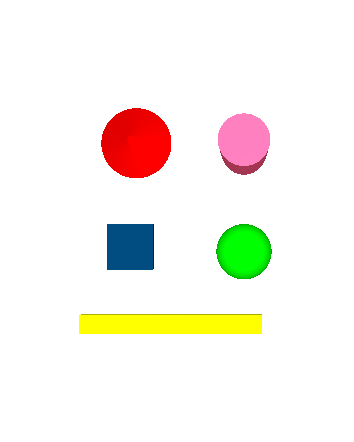

#### Histogram image

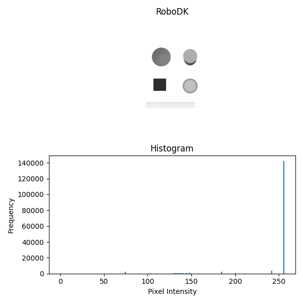

#### 3. Task A3 - Thresholding

- Manual global thresholding was applied with a threshold value of 250 to produce a binary image

#### 4. Task A4 - Cleaning with Morphology

- In the simulated image, everything is clean, so we did not need to apply morphology to remove small points. This step will be important when working with real images.

#### 5. Task A5 – Contours, Area, and Centroid

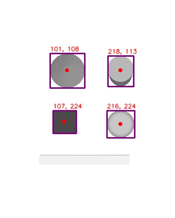

- The function connectedComponentsWithStats helped us get the centers and bounding rectangles of all objects.

## Part B – Real Image

#### 1. Capture at least 4 new real images with paper markers or tiles on the table:

- Image with the black paper markers

- Mosaic tiles all of the same dark color

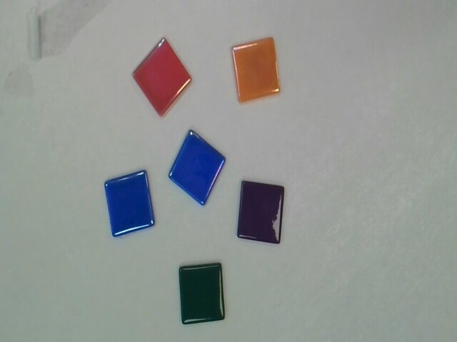

- Mosaic tiles with mixed dark colors

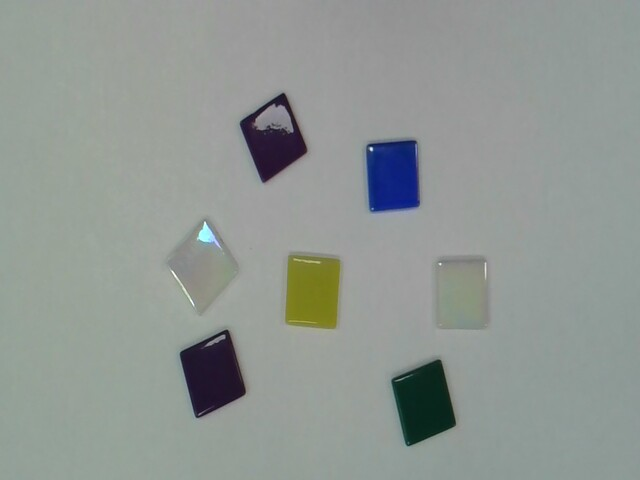

- Mosaic tiles with  bright colors

#### - Histogram images

1. 

2. 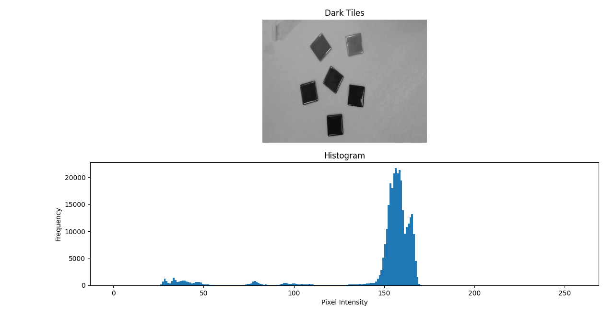

3. 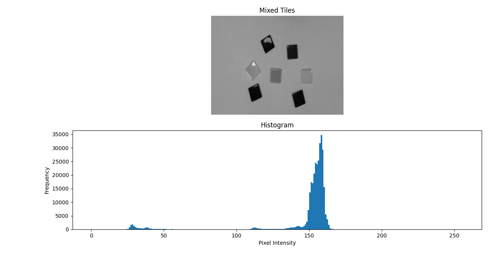

4. 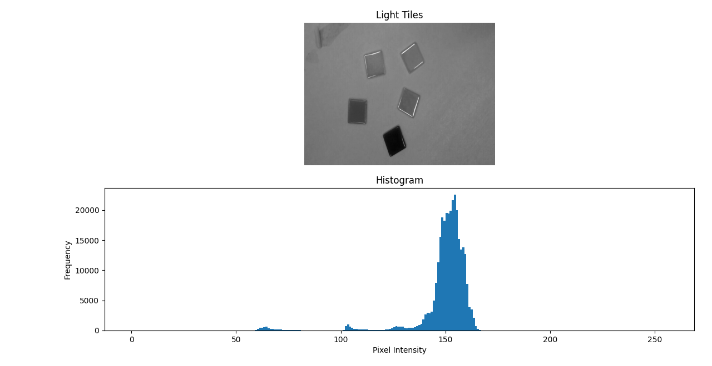

#### 2. Apply the same pipeline (use your code of part A) to each image:

Load image → preprocessing  → thresholding → morphology → contours → centroids → annotation.

- Black paper markers annotated image

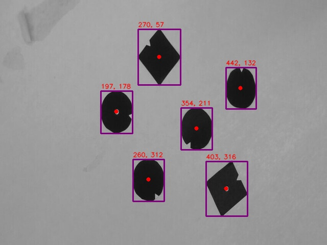

- Dark color mosaic tiles annotated image

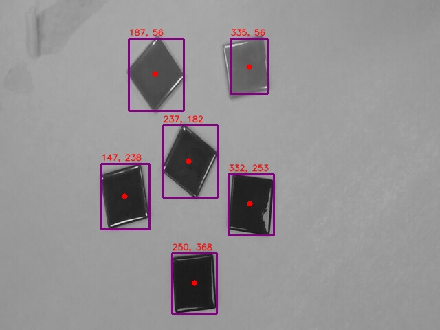

- Mixed dark color tiles annotated image

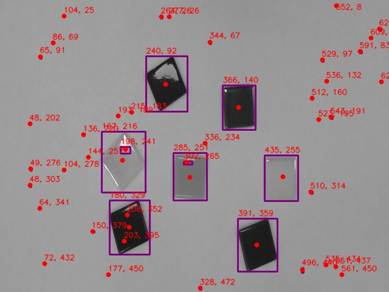

- Bright color tiles annotated image

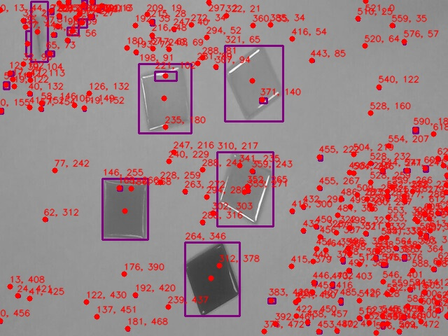

### 3. Check: - Does the pipeline still work? - Is preprocessing (filtering) needed? - Are morphology operations needed?

- For the light color tile images, we use cv2.createCLAHE() function to increase the contrast
between background and foreground then apply adaptive thresholding then cv2.morfologyEX()
and finally cv2.connectComponentsWithStats() to detect light tiles easily.

- And also for the dark color tile image, we use otsu or binary thresholding then morphology and
connectComponentsWithStats which is a usual pipeline explained during the lab.

## Discussion:

1. Which thresholding method gave the most stable results across your images?

- Global thresholding with a value of 250 worked best for our images. It was simple and reliable because the objects are clear from the background. Adaptive thresholding worked sometimes, but global thresholding was easier to use.

Q2: Did filtering and morphology help improve segmentation?

- In the simulated image, everything was clean, so we didn’t need to use filtering or morphology.

- However, for real images, filtering and morphological operations were important to remove noise and small unwanted blobs, which helped improve object detection.

Q3: What kinds of errors still remain (false positives, missed objects, shape distortions)?

- Some objects were missed, especially light colored tiles on the white background.

- While touching objects can cause shape distortions, we avoided this by keeping all objects separate in our images.

- Small textures or reflections sometimes caused the program to detect things that weren’t really objects.

Q4: How would you change the lighting or camera setup in the real lab to make segmentation easier?

- Better lighting and camera setup, like using diffuse light, higher contrast, and adjusting the camera, would make it easier to detect objects.

## Findings 

1. The process was easy to set up and follow.

2. Simulated images were processed very quickly.

3. Real images took a bit longer because filtering and morphology were needed.

4. Overall, the pipeline processes images fast.

5. The method worked well for multiple objects.